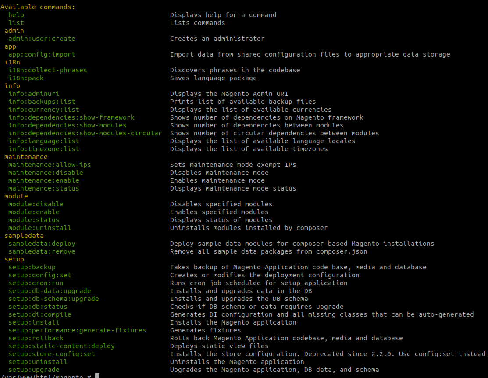
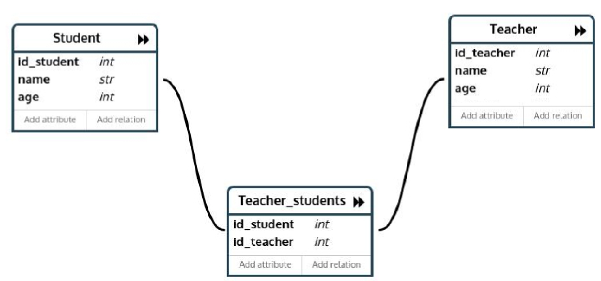
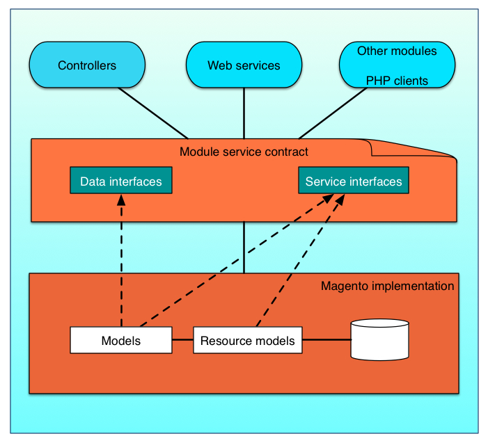

# Magento 2 Backend
----

## Table of Contents
1. [Historia de Magento](#historia-de-magento)
1. [Docker](#docker)
1. [Instalación de Magento](#instalación-de-magento)
1. [Arquitectura de Magento](#arquitectura-de-magento)
1. [Estructura de Ficheros](#estructura-de-ficheros)
1. [Patrones de diseño](#patrones-de-diseño)
1. [Routing](#routing)
1. [CLI commands](#cli-commands)
1. [Module Example](#module-example)
1. [Dependency Injection](#dependency-injection)
1. [Object Manager](#object-manager)
1. [Factories](#factories)
1. [Declarative Schema](#declarative-schema)
1. [Data Patches](#data-patches)
1. [Service Contracts](#service-contracts)
1. [WebAPI](#webapi)
1. [Plugins](#plugins)
1. [Observers](#observers)
1. [Proxies](#proxies)
1. [Cron](#cron)
1. [Logger](#logger)
1. [System Config](#system-config)

## Historia de Magento

Magento es una plataforma escrita en php de código abierto orientada para el desarrollo de comercio electrónico. Es usado por aproximadamente uno de cada cuatro comercios electrónicos, en 2017 la situación estaba así:


Fue lanzado en el 2008 (11 años) por Varien Inc (Ahora Magento Inc) y ha pasado a ser comprado por diversas empresas: en 2011 Ebay compró el 49% y finalmente la totalidad de Magento, pero en 2015 se separó como una compañía independiente al escindirse.

En el 2015 se lanzó la versión 2.0 de la plataforma, cambiándola por completo, en un principio a mejor, sobre el papel... la idea de meter numerosos patrones de diseños para dotar de robustez a la plataforma y estandarizarla fue una completa genialidad a nivel de backend, pero… en el front fue una completa tortura.

En el año 2018 finalmente la compañía fue vendida al actual propietario, Adobe, el cual la adquirió por la cuantía de 1680 millones de dólares.

Se ha ido actualizando la plataforma hasta la actual versión de código estable, la 2.4. En 2020 se ha dejado de dar soporte de manera oficial a las plataformas que funcionen con la versión anterior (Magento 1.x).

## Docker

Docker es un proyecto de código abierto que automatiza el despliegue de aplicaciones dentro de contenedores de software, proporcionando una capa adicional de abstracción y automatización de virtualización de aplicaciones en múltiples sistemas operativos.
​Docker utiliza características de aislamiento de recursos del kernel Linux, tales como cgroups y espacios de nombres (namespaces) para permitir que "contenedores" independientes se ejecuten dentro de una sola instancia de Linux, evitando la sobrecarga de iniciar y mantener máquinas virtuales.

Los contenedores se utilizan como máquinas virtuales extremadamente livianas y modulares. Además, obtiene flexibilidad con estos contenedores: pueden ser creados, copiados y movidos entre entornos con sistemas operativos completamente distintos.

La tecnología Docker usa el kernel de Linux y las funciones de este, como grupos y namespaces, para segregar los procesos, de modo que puedan ejecutarse de manera independiente. El propósito de los contenedores es esta independencia: la capacidad de ejecutar varios procesos y aplicaciones por separado para hacer un mejor uso de su infraestructura y, al mismo tiempo, conservar la seguridad que tendría con sistemas separados.

Las herramientas del contenedor, como Docker, ofrecen un modelo de implementación basado en imágenes. Esto permite compartir una aplicación, o un conjunto de servicios, con todas sus dependencias en varios entornos. Docker también automatiza la implementación de la aplicación (o conjuntos combinados de procesos que constituyen una aplicación) en este entorno de contenedores.

Estas herramientas desarrolladas a partir de los contenedores de Linux, lo que hace a Docker fácil de usar y único, otorgan a los usuarios un acceso sin precedentes a las aplicaciones, la capacidad de implementar rápidamente y control sobre las versiones y su distribución.

Cabe destacar que en Mac o en Windows si que se utlizan máquinas virtuales

### Principales ventajas del uso de Docker:

1. Modularidad: El enfoque Docker para la creación de contenedores se centra en la capacidad de tomar una parte de una aplicación, para actualizarla o repararla, sin necesidad de tomar la aplicación completa.

1. Control de versiones de imágenes y capas: Cada archivo de imagen de Docker se compone de una serie de capas. Estas capas se combinan en una sola imagen. Una capa se crea cuando la imagen cambia. Cada vez que un usuario especifica un comando, como ejecutar o copiar, se crea una nueva capa.
Docker reutiliza estas capas para construir nuevos contenedores, lo cual hace mucho más rápido el proceso de construcción. Los cambios intermedios se comparten entre imágenes, mejorando aún más la velocidad, el tamaño y la eficiencia. El control de versiones es inherente a la creación de capas. Cada vez que se produce un cambio nuevo, básicamente, el usuario tiene un registro de cambios incorporado: control completo de sus imágenes de contenedor.

1. Implementación rápida: Los contenedores basados en Docker pueden reducir el tiempo de implementación de un entorno de horas a segundos. La tecnología de Docker tiene un enfoque granular y controlable, basado en microservicios, que prioriza la eficiencia.

### Hola Mundo con Docker


```
$ docker run alpine /bin/echo 'Hello world'
```


## Instalación de Magento

Para seguir los principales puntos del curso, vamos a seguir un módulo de ejemplo que contiene las partes básicas en el desarrollo de módulos (todo parte back) en Magento 2.

```
$ git clone https://github.com/daniDLL/magento2-course.git
```

### Steps to install
---

### 1. Init

```
$ git fetch
$ git checkout master
```

### 2. Docker Compose UP

```
$ docker-compose up -d
Unable to find image 'alpine:latest' locally
latest: Pulling from library/alpine
188c0c94c7c5: Pull complete
Digest: sha256:c0e9560cda118f9ec63ddefb4a173a2b2a0347082d7dff7dc14272e7841a5b5a
Status: Downloaded newer image for alpine:latest
Hello world
$
```

### 3. Enter docker php container

```
$ docker exec -it magento-php-course-2020 bash
```

### 4. Composer install

```
$ composer install
```

### 5. Magento 2 repository access keys

```
Public key: f7e114d972963174c89e1af64e761a29
Private key: ec51d43d89a4d053e57d5e5f79d968f7
```

### 6. Install Magento 2

```
$ php bin/magento setup:install \
--base-url=http://curso.magento.local/ \
--db-host=mysql \
--db-name=magento \
--db-user=magento \
--db-password=magento \
--admin-firstname=admin \
--admin-lastname=admin \
--admin-email=admin@admin.com \
--admin-user=admin \
--admin-password=admin123 \
--language=en_US \
--currency=EUR \
--timezone=Europe/Madrid \
--elasticsearch-host elasticsearch \
--elasticsearch-port 9200 \
--use-rewrites=1
```

### 7. Config app/etc/env.php (inside the container)

```
$ curl -o app/etc/env.php https://raw.githubusercontent.com/daniDLL/magento2-course/master/app/etc/env.php.bak
```

### 8. Setting file permissions (inside the container)

```
$ find var generated vendor pub/static pub/media app/etc -type f -exec chmod g+w {} +
```

```
$ find var generated vendor pub/static pub/media app/etc -type d -exec chmod g+ws {} +
```

### 9. Add line host to /etc/hosts (outside the container)

```
$ sed -i "3i127.0.0.1  curso.magento.local" /etc/hosts
```

### 10. Enable Magento Developer Mode

```
$ php bin/magento deploy:mode:set developer
```

## Arquitectura de Magento


## Estructura de Ficheros


## Patrones de diseño

Los patrones de diseño son técnicas que se utilizan en el desarrollo para la implementación de código de una forma eficaz y estandarizada.

Magento 2 utiliza numerosos patrones de diseño, los cuales se clasifican en los siguientes tipos:

1. Creacionales: facilitan la tarea de creación de nuevos objetos encapsulando el proceso.
    * Dependency injection: consiste en suministrar los objetos que necesite una clase, en lugar de que estas los creen
    * Abstract Factory: Nos provee una interfaz que delega la creación de un conjunto de objetos relacionados sin necesidad de especificar en ningún momento cuáles son las implementaciones concretas. https://es.wikipedia.org/wiki/Abstract_Factory
    * Factory Method: Expone un método de creación,  delegando en las subclases la implementación de este método. https://en.wikipedia.org/wiki/Factory_method_pattern
    * Singleton: limita a uno el número de instancias posibles de una clase en nuestro programa, y proporciona un acceso global al mismo. https://es.wikipedia.org/wiki/Singleton
    * Code generation: consiste en la creación de clases en tiempo de ejecución, es un patrón en el que se basa el factory method
1. Estructurales: especifican la forma en que unas clases se relacionan con otras.
    * Flyweight: Una gran cantidad de objetos comparte un mismo objeto con propiedades comunes con el fin de ahorrar memoria.
    * Proxy: Es una clase que funciona como interfaz hacia cualquier otro tipo de objeto.
1. Comportamiento: gestionan algoritmos, relaciones y responsabilidades entre objetos.
    * Iterator: Se utiliza para poder movernos por los elementos de un conjunto de forma secuencial sin necesidad de exponer su implementación específica
    * Observer: Los objetos son capaces de suscribirse a una serie de eventos que otro objetivo va a emitir, y serán avisados cuando esto ocurra.

En magento 2 el Object Manager es el que se encarga de orquestar toda la inyección de dependencias a nivel de php, centrándonos en el backend, el propósito de este curso.


## Routing

En aplicaciones web, como Magento, "routing" es el proceso de redireccionar (o enlazar) una petición a una URL hacía la clase correspondiente para que la gestione, procese y devuelve el resultado.


La Clase `FrontController` busca sobre un listado de `Routers` hasta que uno de ellos hace `match` y procesa la petición. Cuando el `FrontController` encuentra un `router` que haga `match` entonces redirige la petición hacia la `action class` que ha devuelto el `router`, que será quien gestione la petición y devuelve/renderice el resultado (json, html, etc).

La Clase `Router` relaciona una petición (URL) con su correspondiente `action class` que procesará la petición.

Por defecto en Magento existen 5 `Routers` para el Area de `frontend`:

1. Robots - sort_order: 10 [Matches request to the robots.txt file]
1. UrlRewrite - sort_order: 20 [Matches requests with URL defined in the database]
1. Standard - sort_order: 30 [The standard router]
1. CMS - sort_order: 60 [Matches requests for CMS pages]
1. Default - solr_order: 100 [The default router]

Por defecto en Magento existen 2 `Routers` para el Area de `adminhtml`:

1. Admin - sort_order: 10 [Matches requests in the Magento admin area]
1. Default - sort_order: 100 [The default router for the admin area]

El `Router Standard` enlazará aquellas urls que cumplan el formato estandar de url de Magento:

> `<store-url>/<store-code>/<front-name>/<controller-name>/<action-name>`

Donde:

* `store-url`: Especifica la url base de la instancia de Magento.
* `store-code`: Especifica el store code.
* `front-name`: Especifica el frontName a usar.
* `controller-name`: Especifica el nombre del controlador.
* `action-name`: Especifica el nombre de la acción.

Ejemplo:

> http://curso.magento.local/radiant-tee.html

> http://curso.magento.local/catalog/product/view/id/1562

Por último el `Default Router` sirve para recoger todas aquellas peticiones que no han `matcheado` con nada y le sirve a Magento para redirigir a la página 404 indicando al usuario que esa URL no significa nada actualmente.

## CLI commands



## Module Example

```
$ git checkout 2/module-creation
```



## Dependency Injection

La inyección de dependencias es un patrón de diseño que permite declarar que un objeta A depende de otro objeto externo B. Normalmente las dependencias que se declaran son interfaces y la instancia del objeto B implementa esa o esas interfaces.

Esto permite desacoplar qué dependencias recibe cada objeto y por lo tanto ya no necesita preocuparse por inicializar sus propias dependencias. En función de qué configuración haya en la aplicación se decidirá qué clase implementa las interfaces definidas.

En resumen, definimos lo qué hacen las clases que queremos tener como dependencia pero no la implementación concreta, de esa manera podemos "intercambiar" esas dependencias desacopladamente sin tener que modificar la clase destino.

Este mapeo o configuración de las inyecciones de dependencias se realiza en los ficheros `di.xml`.

Magento usa su herramienta de compilación de código para recolectar todas las dependencias de las clases y almacenarlas en sus ficheros. Durante el proceso de instanciación de una clase el `Object Manager` usa la información de esos ficheros para crear objectos concretos en la aplicación.

Las clases de servicio `Service Classes` que no existían realmente en el código (virtual), como los `proxies`, `factories` y `interceptors` que se declaran en los `di.xml`, se generan con la ayuda de este compilador de Magento y se almacenan en el directorio `<magento_root>/generated`.

### Virtual types

Un `virtual type` te permite cambiar los argumentos de una dependencia especifica y cambiar el comportamiento de una clase en particular. Esto permite crear clases custom en base a otras ya existentes sin necesidad de crearlas "físicamente" para cambiar cierto comportamiento.

Ejemplo:

```xml
<config xmlns:xsi="http://www.w3.org/2001/XMLSchema-instance" xsi:noNamespaceSchemaLocation="urn:magento:framework:ObjectManager/etc/config.xsd">
    <virtualType name="Hiberus\Custom\Model\Config" type="Magento\Core\Model\Config">
        <arguments>
            <argument name="type" xsi:type="string">system</argument>
        </arguments>
    </virtualType>
    <type name="Magento\Core\Model\App">
        <arguments>
            <argument name="config" xsi:type="object">Hiberus\Custom\Model\Config</argument>
        </arguments>
    </type>
</config>
```

## Object Manager

Es una clase que nos permite crear cualquier objecto de la aplicación.

> Las buenas prácticas de magento no permiten usar directamente el `ObjectManager` para instanciar clase porque oculta las dependencias reales de una clase.

Responsabilidades:

* Creación de objetos en `factories` y `proxies`.
* Implementa el patrón `singleton` ya que permite devolver instancia compartidas de objectos (si se quiere), tambien se le puede solicitar que te devuelva una recien creada.
* Gestión de dependencias creando las clases concretas de las interfaces que define una clase en su constructor.
* Automáticamente instancia los parámetros de los constructores de clase.

## Factories

Los `Factories` son clases que instancian objectos no-inyectables, por ejemplo, los modelos que reprensentan una entidad concreta.

Un ejemplo es la clase `Magento\Catalog\Model\Product`. Esa clase reprensenta un producto en base de datos con sus atributos, no podemos inyectar esa clase en el constructor sino que tenemos que inyectarnos su `Factory` correspondiente que nos genere instancias `Magento\Catalog\Model\ProductFactory`.

Los `Factories` son generados por el `ObjectManager` y se guardan en el directorio `generated`. Internamente están compuesto por el object manager que se encarga de hacer un create de la clase que queremos generar.

En el ejemplo que estamos viendo el resultado es este:

```php
<?php
namespace Magento\Catalog\Model;

/**
 * Factory class for @see \Magento\Catalog\Model\Product
 */
class ProductFactory
{
    /**
     * Object Manager instance
     *
     * @var \Magento\Framework\ObjectManagerInterface
     */
    protected $_objectManager = null;

    /**
     * Instance name to create
     *
     * @var string
     */
    protected $_instanceName = null;

    /**
     * Factory constructor
     *
     * @param \Magento\Framework\ObjectManagerInterface $objectManager
     * @param string $instanceName
     */
    public function __construct(\Magento\Framework\ObjectManagerInterface $objectManager, $instanceName = '\\Magento\\Catalog\\Model\\Product')
    {
        $this->_objectManager = $objectManager;
        $this->_instanceName = $instanceName;
    }

    /**
     * Create class instance with specified parameters
     *
     * @param array $data
     * @return \Magento\Catalog\Model\Product
     */
    public function create(array $data = [])
    {
        return $this->_objectManager->create($this->_instanceName, $data);
    }
}
```

Por defecto no es necesario tener que crear los `Factories` pero si se quiere que hagan un comportamiento especial adicional se pueden crear manualmente y utilizando el object manager realizar el mismo procedimiento que los autogenerados.

### Cómo usar los `Factories`

Se puede obtener el singleton de un factory usando la inyección de dependencias.

El siguiente ejemplo muestra como conseguir el Factory de la clase Block:

```php
function __construct(\Magento\Cms\Model\BlockFactory $blockFactory) {
    $this->blockFactory = $blockFactory;
}
```

Llamando a la función `create()` nos devuelve una instancia nueva de la clase Block:

```php
$block = $this->blockFactory->create();
```

Para clases cuyo constructor necesita parámetros, se los podemos pasar al Factory como un array y el object manager lo usará para pasárselo al construct de la clase origen:

```php
$resultItem = $this->itemFactory->create([
  'title' => $item->getQueryText(),
  'num_results' => $item->getNumResults(),
]);
```

## Declarative Schema

`Declarative Schema` tiene como objetivo simplificar los procesos de instalación y actualización de Magento. Anteriormente los desarrolladores tenían que crear `scripts` de base de datos en PHP.

Este nuevo sistema permite declarar el estado final deseado de la base de datos y el propio sistema se reajusta en base a los cambios que hacemos en el declarative schema.

Tan solo escribiendo y modificando XMLs nos permite crear, actualizar, borrar tablas de base de datos sin mucho trabajo.

[Informacion detallada sobre `Declarative Schema`](https://devdocs.magento.com/guides/v2.4/extension-dev-guide/declarative-schema/db-schema.html)

## Data Patches

Un `Data Patch` es una clase que contiene intrucciones de modificación de datos. Por ejemplo añadir atributos de producto nuevos, incluir o modificar configuraciones de Magento, etc. Todo lo que implica añadir o modificar información en la base de datos debe ir en un data patch.

Los data patch solo se ejecutan una vez cuando se actualiza la aplicación. También se pueden encadenar distintos data patches que tiene dependencia unos con otros, mediante la función `getDependencies()` se especifican los data patches que tienen que ejecutarse antes que el actual.

## Service Contracts

Primero tenemos que entender la relación entre los modelos, resource models, collections y repositories, se trata de un ORM (Object Relational Mapping), que nos sirve para abstraernos de la base de datos lo más posible:

* Models: son la representación de la entidades.
* Resource Models: son los “mapeadores” de datos para la estructura de almacenamiento. El componente que se encarga de escribir y leer los datos.
* Collections: son el encapsulado de datos y conjuntos de funcionalidades relacionadas.



## WebAPI

Para configurar nuevos `endpoints` a la API de magento basta con crear el fichero `etc/webapi.xml`:

```xml
<?xml version="1.0"?>
<routes xmlns:xsi="http://www.w3.org/2001/XMLSchema-instance" xsi:noNamespaceSchemaLocation="urn:magento:module:Magento_Webapi:etc/webapi.xsd">
    <route url="/V1/sample/students" method="GET">
        <service class="Hiberus\Sample\Api\StudentRepositoryInterface" method="getList"/>
        <resources>
            <resource ref="anonymous" />
        </resources>
    </route>
</routes>

```

## Plugins

Los `Plugins` son clases que permiten modificar el comportamiento de las funciones públicas de las clases interceptando la llamada a la función y ejecutado código antes, después o alrrededor (sustituyendo la original). Esto nos permite sustituir o extender el comportamiento original de los métodos públicos de cualquier clase o interfaz.

Esta intercepción de los métodos originales reduce el conflicto entre extensiones que modifican el comportamiento de la misma clase o método. Magento llama a estos interceptores secuencialmente siguiente un orden configurado.

`Los plugins no pueden usarse en los siguientes casos`:

* `Final` methods
* `Final` classes
* `Non-public` methods.
* Static methods
* `__construct()`
* Virtual types
* Objectos que son instanciados antes de la clase "interceptadora" del core: `Magento\Framework\Interception`

### Cómo declarar un Plugin

Se declaran en los ficheros `di.xml`:

```xml
<config>
    <type name="{ObservedType}">
      <plugin name="{pluginName}" type="{PluginClassName}" sortOrder="1" disabled="false" />
    </type>
</config>
```

Se deben especificar esto elementos:

* `type name` - La clase o interfaz que el plugin observa.
* `plugin name` - El nombre que identifica al plugin. Debe ser único para diferenciarse, ya que magento junta todos los xmls en uno y por tanto es necesario diferenciarlos ya que sino se unificarán en uno solo.
* `plugin type` - La clase que implementa nuestro plugin.
* (Opcional) `sortOrder` - Los plugins que llaman al mismo método se ejecutan siguiendo ese orden, de menor a mayor sort order.
* (Opcional) `disabled` - Nos permite poder desabilitar un plugin. Por defecto es "false" y no hace falta especificarlo.

Para los 3 tipos de plugin siempre se manda como primer parámetro de la función "interceptora" una instancia del objeto "interceptado" que nos da acceso a todas las funciones públicas del mismo.

Otro punto importante, es el nombrado de las funciones en los plugins. Por convención se capitaliza siempre la función "intercetada" y se le añade al principio el tipo de plugin que le aplica, por ejemplo:

```php
public function setName($name)
{
    ...
}
```

Esta función en la clase del plugin podrá tener los siguientes nombres:
* beforeSetName
* aroundSetName
* afterSetName


### Before methods

Estos plugins se ejecutan antes de llamar a la función principal y por lo tanto el objetivo principal de los plugins de tipo `before` es modificar o cambiar los argumentos de una función, que se devuelven como resultado del plugin. Si la función "interceptada" tiene más de un parámentro se devolverá un array de argumentos. En caso de que no queramos modificar los argumentos, sino que simplemente queriamos engancharnos aquí por cualquier otro motivo se devolverá como resultado `null`.

Un ejemplo que modifica un parámetro de entrada a una función:

```php
<?php
namespace My\Module\Plugin;

class ProductAttributesUpdater
{
    public function beforeSetName(\Magento\Catalog\Model\Product $subject, $name)
    {
        return ['(' . $name . ')'];
    }
}
```

### After methods

Los plugins de tipo `after` son por el contrario ejecutados cuando la función "interceptada" ya ha finalizado y por lo tanto el objetivo de estos es modificar o cambios el resultado devuelvo por dicha función.

Aquí podemos ver un ejemplo que altera el resultado devuelto:

```php
<?php
namespace My\Module\Plugin;

class ProductAttributesUpdater
{
    public function afterGetName(\Magento\Catalog\Model\Product $subject, $result)
    {
        return '|' . $result . '|';
    }
}
```

### Around methods

Este tipo de plugins lo que nos permite es "englobar" la función original, de esta manera podemos sobreescribir su comportamiento totalmente por uno nuestro, o complementarlo.

Veamos un ejemplo:

```php
<?php
namespace My\Module\Plugin;

class ProductAttributesUpdater
{
    public function aroundSave(\Magento\Catalog\Model\Product $subject, callable $proceed)
    {
        $someValue = $this->doSmthBeforeProductIsSaved();
        $returnValue = null;

        if ($this->canCallProceedCallable($someValue)) {
            $returnValue = $proceed();
        }

        if ($returnValue) {
            $this->postProductToFacebook();
        }

        return $returnValue;
    }
}
```

Terminamos de entender los plugins revisando la función que implenta y gestiona los interceptores o plugins, `una auténtica obra de arte`:

```php
/**
    * Calls plugins for a given method.
    *
    * @param string $method
    * @param array $arguments
    * @param array $pluginInfo
    * @return mixed|null
    */
protected function ___callPlugins($method, array $arguments, array $pluginInfo)
{
    $subject = $this;
    $type = $this->subjectType;
    $pluginList = $this->pluginList;

    $next = function (...$arguments) use (
        $method,
        &$pluginInfo,
        $subject,
        $type,
        $pluginList,
        &$next
    ) {
        $capMethod = ucfirst($method);
        $currentPluginInfo = $pluginInfo;
        $result = null;

        if (isset($currentPluginInfo[DefinitionInterface::LISTENER_BEFORE])) {
            // Call 'before' listeners
            foreach ($currentPluginInfo[DefinitionInterface::LISTENER_BEFORE] as $code) {
                $pluginInstance = $pluginList->getPlugin($type, $code);
                $pluginMethod = 'before' . $capMethod;
                $beforeResult = $pluginInstance->$pluginMethod($this, ...array_values($arguments));

                if ($beforeResult !== null) {
                    $arguments = (array)$beforeResult;
                }
            }
        }

        if (isset($currentPluginInfo[DefinitionInterface::LISTENER_AROUND])) {
            // Call 'around' listener
            $code = $currentPluginInfo[DefinitionInterface::LISTENER_AROUND];
            $pluginInfo = $pluginList->getNext($type, $method, $code);
            $pluginInstance = $pluginList->getPlugin($type, $code);
            $pluginMethod = 'around' . $capMethod;
            $result = $pluginInstance->$pluginMethod($subject, $next, ...array_values($arguments));
        } else {
            // Call original method
            $result = $subject->___callParent($method, $arguments);
        }

        if (isset($currentPluginInfo[DefinitionInterface::LISTENER_AFTER])) {
            // Call 'after' listeners
            foreach ($currentPluginInfo[DefinitionInterface::LISTENER_AFTER] as $code) {
                $pluginInstance = $pluginList->getPlugin($type, $code);
                $pluginMethod = 'after' . $capMethod;
                $result = $pluginInstance->$pluginMethod($subject, $result, ...array_values($arguments));
            }
        }

        return $result;
    };

    $result = $next(...array_values($arguments));
    $next = null;

    return $result;
}
```

Veamos un ejemplo de orden de ejecución de los plugins:

```xml
<config>
    <type name="Magento\Framework\App\Action\Action">
        <plugin name="vendor_module_plugina" type="Vendor\Module\Plugin\PluginA" sortOrder="10" />
        <plugin name="vendor_module_pluginb" type="Vendor\Module\Plugin\PluginB" sortOrder="20" />
        <plugin name="vendor_module_pluginc" type="Vendor\Module\Plugin\PluginC" sortOrder="30" />
    </type>
</config>
```
#### Escenario 1

||PLUGINA|PLUGINB|PLUGINC|
|---|---|---|---|
|sortOrder|10|20|30|
|before|beforeDispatch()|beforeDispatch()|beforeDispatch()|
|around|   |   |   |
|after|afterDispatch()|afterDispatch()|afterDispatch()|

La ejecución será en este orden:
* PluginA::beforeDispatch()
* PluginB::beforeDispatch()
* PluginC::beforeDispatch()
  * Action::dispatch()
* PluginA::afterDispatch()
* PluginB::afterDispatch()
* PluginC::afterDispatch()

#### Escenario 2

||PLUGINA|PLUGINB|PLUGINC|
|---|---|---|---|
|sortOrder|10|20|30|
|before|beforeDispatch()|beforeDispatch()|beforeDispatch()|
|around|   |	aroundDispatch()|   |
|after|afterDispatch()|afterDispatch()|afterDispatch()|

`PluginB::aroundDispatch()`:

```php
class PluginB
{
    public function aroundDispatch(\Magento\Framework\App\Action\Action $subject, callable $next, ...$args)
    {
        // The first half of code goes here
        // ...

        $result = $next(...$args);

        // The second half of code goes here
        // ...

        return $result;
    }
}
```

La ejecución será en este orden:
* PluginA::beforeDispatch()
* PluginB::beforeDispatch()
* PluginB::aroundDispatch()
  * PluginC::beforeDispatch()
    * Action::dispatch()
  * PluginC::afterDispatch()
* PluginB::aroundDispatch()
* PluginA::afterDispatch()
* PluginB::afterDispatch()

## Observers

Este concepto está basado en el patrón de diseño Publicar-Suscribir. Hay un conjunto de componentes que publicar y otros que escuchan esperando recibir esas publicaciones.

En este caso tenemos `Eventos` que serán las publicaciones y los `Observers` que serán los que escuchan a esos eventos y ejecutan su tarea especifica.

En magento puedes publicar o lanzar un evento en el punto en que uno quiera y además puedes publicar toda la información que quieras pasarle al Evento.
Para esa gestión de los Eventos se hace uso de la interfaz `Magento\Framework\Event\ManagerInterface`.

Un ejemplo de generación de eventos:

```php
namespace MyCompany\MyModule;

use Magento\Framework\Event\ManagerInterface as EventManager;

class MyClass
{
  /**
   * @var EventManager
   */
  private $eventManager;

  /*
   * @param \Magento\Framework\Event\ManagerInterface as EventManager
   */
  public function __construct(EventManager $eventManager)
  {
    $this->eventManager = $eventManager;
  }

  public function something()
  {
    $eventData = null;
    // Code...
    $this->eventManager->dispatch('my_module_event_before');
    // More code that sets $eventData...
    $this->eventManager->dispatch('my_module_event_after', ['myEventData' => $eventData]);
  }
}
```

Una vez que tenemos nuestros eventos codificados para lanzarse, podemos dejarlos así para que alguien más adelante pueda recibirlos desde el mismo módulo o desde cualquier otro.

Para poder recibirlo necesitaremos tener un componente `Observer`. Para ello basta con crear una clase que implemente la interfaz `Magento\Framework\Event\ObserverInterface` y por otro lado definir la relación evento-observer en el fichero `events.xml`.

Un `Observer` de ejemplo:

```php
namespace MyCompany\MyModule\Observer;

use Magento\Framework\Event\ObserverInterface;

class AnotherObserver implements ObserverInterface
{
  public function __construct()
  {
    // Observer initialization code...
    // You can use dependency injection to get any class this observer may need.
  }

  public function execute(\Magento\Framework\Event\Observer $observer)
  {
    $myEventData = $observer->getData('myEventData');
    // Additional observer execution code...
  }
}
```

Y su correspondiente `events.xml`:

```xml
<?xml version="1.0"?>
<config xmlns:xsi="http://www.w3.org/2001/XMLSchema-instance" xsi:noNamespaceSchemaLocation="urn:magento:framework:Event/etc/events.xsd">
    <event name="my_module_event_before">
        <observer name="myObserverName" instance="MyCompany\MyModule\Observer\MyObserver" />
    </event>
    <event name="my_module_event_after">
        <observer name="myObserverName" instance="MyCompany\MyModule\Observer\AnotherObserver" />
    </event>
</config>
```

Para deshabilitar un observer, se puede hacer igual que los plugins, mediante el atributo `disabled`:

```xml
<?xml version="1.0"?>
<config xmlns:xsi="http://www.w3.org/2001/XMLSchema-instance" xsi:noNamespaceSchemaLocation="urn:magento:framework:Event/etc/events.xsd">
    <event name="my_module_event_before">
        <observer name="myObserverName" disabled="true" />
    </event>
</config>
```

## Proxies

Los `proxies` surgen de la necesidad de poder marcar determinadas dependencias y que solo se instancien cuando de verdad se utilizan, porque como ya sabemos por defecto el object manager al crear la instancia de un objeto también instancia los objetos de las dependencias definidas en el constructor.

Pero si una de esas dependencias tiene un trabajo particular en su constructor que sea muy costoso en tiempo o en recursos puede afectarnos en nuestra clase y provocar que también sea lenta, ya que tendríamos que esperar a que terminara de instanciarse la dependencia.

Con la ayuda de los proxies podemos solventar ese problema, e indicándole al object manager sobre que clases tiene que `postponer` esa instanciacion.

> Podemos ver un ejemplo de uso en el [Repositorio del Curso](https://github.com/daniDLL/magento2-course), accediendo a la rama `8/proxies`.

## Cron

Magento permite la definición de tareas programadas en el tiempo para llevar a cabo procesos recurrentes, como pueden ser la regeneración de los indexers, borrados de caché nocturno, envío de emails asíncronos, etc.

El `entrypoint` para los crones se encuentra en: `pub/cron.php`.

En magento se pueden definir tanto tareas "cron" personalizadas como grupos de "crones".

Por defecto Magento trae los siguientes `cron_group`:

* default
* index
* consumers

Tareas "cron" que estén en diferentes grupos de cron se pueden ejecutar en paralelo, por lo que es algo importante a tener en cuenta a la hora de definir uno nuevo, ya que quizá nos interese crear nuestro nuevo Cron bajo un nuevo Cron Group.

Para definir un nuevo cron solo hay que crear un nuevo fichero de configuración en `etc/crontab.xml` dentro de nuestro módulo:

```xml
<config>
    <group id="<group_name>">
        <job name="<job_name>" instance="<classpath>" method="<method>">
            <schedule><time></schedule>
        </job>
    </group>
</config>
```

Para definir un nuevo `cron_group` solo hay que crear un nuevo fichero de configuración en `etc/cron_groups.xml` dentro de nuestro módulo:

```xml
<config>
    <group id="<group_name>">
        <schedule_generate_every>1</schedule_generate_every>
        <schedule_ahead_for>4</schedule_ahead_for>
        <schedule_lifetime>2</schedule_lifetime>
        <history_cleanup_every>10</history_cleanup_every>
        <history_success_lifetime>60</history_success_lifetime>
        <history_failure_lifetime>600</history_failure_lifetime>
        <use_separate_process>1</use_separate_process>
    </group>
</config>
```

## Logger

Magento utiliza [Monolog](https://github.com/Seldaek/monolog) para escribir sus logs. Usa monolog como una implementación de la interfaz `Psr\Log\LoggerInterface`, la cual deberemos añadir a las dependencias de nuestra clase para poder escribir en los logs por defecto de Magento (system.log, debug.log, exception.log, etc).

Para escribir logs en un fichero personalizado realizaremos lo siguiente en nuestro fichero `di.xml`:

```xml
<!-- Logger -->
<virtualType name="Hiberus\Sample\Logger\SampleDebug" type="Magento\Framework\Logger\Handler\Base">
    <arguments>
        <argument name="fileName" xsi:type="string">/var/log/hiberus_sample.log</argument>
    </arguments>
</virtualType>

<virtualType name="Hiberus\Sample\Logger\Monolog" type="Magento\Framework\Logger\Monolog">
    <arguments>
        <argument name="handlers" xsi:type="array">
            <item name="debug" xsi:type="object">Hiberus\Sample\Logger\SampleDebug</item>
        </argument>
    </arguments>
</virtualType>

<type name="Hiberus\Sample\Logger\SampleLogger">
    <arguments>
        <argument name="logger" xsi:type="object">Hiberus\Sample\Logger\Monolog</argument>
    </arguments>
</type>
```

Gracias a los `Virtual Types` podemos modificar la lógica de magento para añadir un custom log sin tener que crear ni una sola clase y tan solo incluyendo configuración le decimos a Magento donde queremos que escriba nuestros logs.

## System Config

Podemos tener una gestión de la configuración de los módulos en la cual los clientes pueden interactuar y definir ellos cómo quieren configurar los desarrollos.

Para ello se utilizan los ficheros `etc/adminhtml/system.xml` donde definimos los campos configurables:

```xml
<?xml version="1.0"?>
<config xmlns:xsi="http://www.w3.org/2001/XMLSchema-instance" xsi:noNamespaceSchemaLocation="urn:magento:module:Magento_Config:etc/system_file.xsd">
    <system>
        <tab id="hiberus_tab" translate="label" sortOrder="1">
            <label>HIBERUS</label>
        </tab>
        <section id="hiberus_sample" translate="label" sortOrder="10" showInDefault="1" showInWebsite="1" showInStore="1">
            <label>Sample Configuration</label>
            <tab>hiberus_tab</tab>
            <resource>Hiberus_Sample::config</resource>
            <group id="general_config" translate="label" type="text" sortOrder="10" showInDefault="1">
                <label>Config Label</label>
                <hide_in_single_store_mode>1</hide_in_single_store_mode>
                <field id="enable" translate="label" type="select" sortOrder="1" showInDefault="1" canRestore="1">
                    <label>Enable</label>
                    <source_model>Magento\Config\Model\Config\Source\Yesno</source_model>
                </field>
            </group>
        </section>
    </system>
</config>
```

Para definir unos valores por defecto de estos campos "configurables" los podemos fijar en el fichero `etc/config`:

```xml
<?xml version="1.0"?>
<config xmlns:xsi="http://www.w3.org/2001/XMLSchema-instance" xsi:noNamespaceSchemaLocation="urn:magento:module:Magento_Store:etc/config.xsd">
    <default>
        <hiberus_sample>
            <general_config>
                <enable>1</enable>
            </general_config>
        </hiberus_sample>
    </default>
</config>

```

Por otro lado, magento nos permite definir un conjunto de menus donde enlazar los distintos desarrollos del admin de una manera más accesible, esto lo podemos conseguir definiendo los elementos del menú en el fichero `etc/adminhtml/menu.xml`:

```xml
<?xml version="1.0"?>
<config xmlns:xsi="http://www.w3.org/2001/XMLSchema-instance" xsi:noNamespaceSchemaLocation="urn:magento:module:Magento_Backend:etc/menu.xsd">
    <menu>
        <add id="Hiberus_Sample::sample" title="Hiberus" translate="title" module="Hiberus_Sample" sortOrder="999" resource="Hiberus_Sample::sample"/>
        <add id="Hiberus_Sample::sample_config" title="Configuration" translate="title" module="Hiberus_Sample" sortOrder="10" parent="Hiberus_Sample::sample" action="admin/system_config/edit/section/hiberus_sample/" resource="Hiberus_Sample::config"/>
    </menu>
</config>
```

> All rights reserved to [Magento2 DevDoc](https://devdocs.magento.com/#/individual-contributors)

> Gracias a [Víctor Jurado Usón](https://github.com/vjuradouson "Víctor Jurado Usón") por la gran introducción y apuntes sobre el curso de Magento 2 - Backend.
