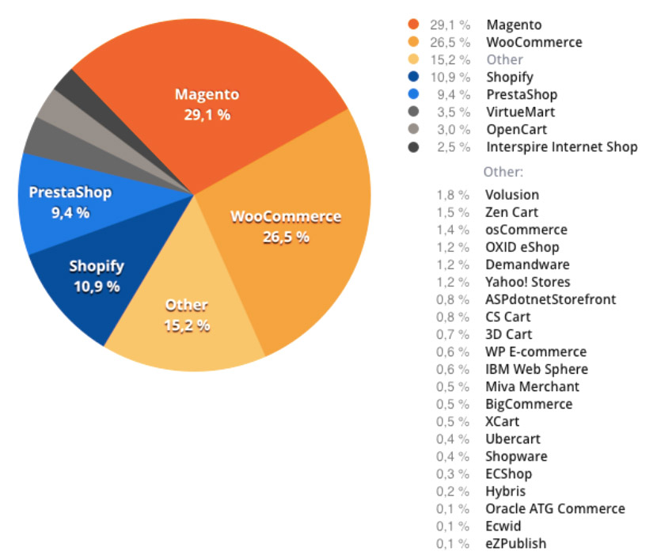
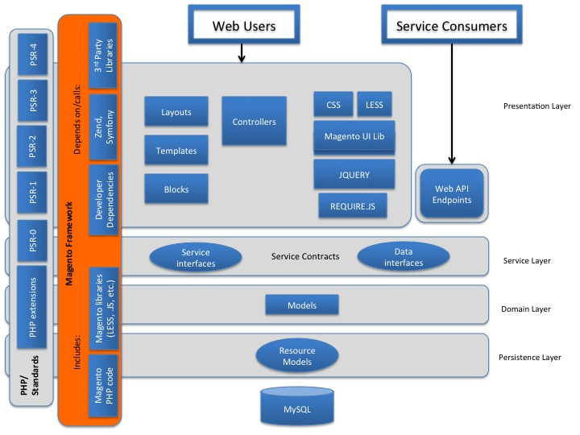

# Magento 2 Backend
----

## Table of Contents
1. [Historia de Magento](/magento2-backend#historia-de-magento)
1. [Docker](/magento2-backend#docker)
1. [Instalación de Magento](/magento2-backend#instalación-de-magento)
1. [Arquitectura de Magento](/magento2-backend#arquitectura-de-magento)
1. [Estructura de Ficheros](/magento2-backend#estructura-de-ficheros)
1. [Patrones de diseño](/magento2-backend#design-patterns)
1. [Routing](/magento2-backend#routing)
1. [Service Contracts](/magento2-backend#service-contracts)
1. [CLI commands](/magento2-backend#cli-commands)
1. [Management Entities](/magento2-backend#management-entities)
1. [Observers](/magento2-backend#observers)
1. [Plugins](/magento2-backend#plugins)
1. [Proxies](/magento2-backend#proxies)

## Historia de Magento

Magento es una plataforma escrita en php de código abierto orientada para el desarrollo de comercio electrónico. Es usado por aproximadamente uno de cada cuatro comercios electrónicos, en 2017 la situación estaba así:



Fue lanzado en el 2008 (11 años) por Varien Inc (Ahora Magento Inc) y ha pasado a ser comprado por diversas empresas: en 2011 Ebay compró el 49% y finalmente la totalidad de Magento, pero en 2015 se separó como una compañía independiente al escindirse.

En el 2015 se lanzó la versión 2.0 de la plataforma, cambiándola por completo, en un principio a mejor, sobre el papel... la idea de meter numerosos patrones de diseños para dotar de robustez a la plataforma y estandarizarla fue una completa genialidad a nivel de backend, pero… en el front fue una completa tortura.

En el año 2018 finalmente la compañía fue vendida al actual propietario, Adobe, el cual la adquirió por la cuantía de 1680 millones de dólares.

Se ha ido actualizando la plataforma hasta la actual versión de código estable, la 2.4. En 2020 se ha dejado de dar soporte de manera oficial a las plataformas que funcionen con la versión anterior (Magento 1.x).

## Docker

Docker es un proyecto de código abierto que automatiza el despliegue de aplicaciones dentro de contenedores de software, proporcionando una capa adicional de abstracción y automatización de virtualización de aplicaciones en múltiples sistemas operativos.
​Docker utiliza características de aislamiento de recursos del kernel Linux, tales como cgroups y espacios de nombres (namespaces) para permitir que "contenedores" independientes se ejecuten dentro de una sola instancia de Linux, evitando la sobrecarga de iniciar y mantener máquinas virtuales.

Los contenedores se utilizan como máquinas virtuales extremadamente livianas y modulares. Además, obtiene flexibilidad con estos contenedores: pueden ser creados, copiados y movidos entre entornos con sistemas operativos completamente distintos.

La tecnología Docker usa el kernel de Linux y las funciones de este, como grupos y namespaces, para segregar los procesos, de modo que puedan ejecutarse de manera independiente. El propósito de los contenedores es esta independencia: la capacidad de ejecutar varios procesos y aplicaciones por separado para hacer un mejor uso de su infraestructura y, al mismo tiempo, conservar la seguridad que tendría con sistemas separados.

Las herramientas del contenedor, como Docker, ofrecen un modelo de implementación basado en imágenes. Esto permite compartir una aplicación, o un conjunto de servicios, con todas sus dependencias en varios entornos. Docker también automatiza la implementación de la aplicación (o conjuntos combinados de procesos que constituyen una aplicación) en este entorno de contenedores.

Estas herramientas desarrolladas a partir de los contenedores de Linux, lo que hace a Docker fácil de usar y único, otorgan a los usuarios un acceso sin precedentes a las aplicaciones, la capacidad de implementar rápidamente y control sobre las versiones y su distribución.

Cabe destacar que en Mac o en Windows si que se utlizan máquinas virtuales

### Principales ventajas del uso de Docker:

1. Modularidad: El enfoque Docker para la creación de contenedores se centra en la capacidad de tomar una parte de una aplicación, para actualizarla o repararla, sin necesidad de tomar la aplicación completa.

1. Control de versiones de imágenes y capas: Cada archivo de imagen de Docker se compone de una serie de capas. Estas capas se combinan en una sola imagen. Una capa se crea cuando la imagen cambia. Cada vez que un usuario especifica un comando, como ejecutar o copiar, se crea una nueva capa.
Docker reutiliza estas capas para construir nuevos contenedores, lo cual hace mucho más rápido el proceso de construcción. Los cambios intermedios se comparten entre imágenes, mejorando aún más la velocidad, el tamaño y la eficiencia. El control de versiones es inherente a la creación de capas. Cada vez que se produce un cambio nuevo, básicamente, el usuario tiene un registro de cambios incorporado: control completo de sus imágenes de contenedor.

1. Implementación rápida: Los contenedores basados en Docker pueden reducir el tiempo de implementación de un entorno de horas a segundos. La tecnología de Docker tiene un enfoque granular y controlable, basado en microservicios, que prioriza la eficiencia.

### Hola Mundo con Docker


```
$ docker run alpine /bin/echo 'Hello world'
```


## Instalación de Magento

Para seguir los principales puntos del curso, vamos a seguir un módulo de ejemplo que contiene las partes básicas en el desarrollo de módulos (todo parte back) en Magento 2.

```
$ git clone https://github.com/daniDLL/magento2-course.git
```

### Steps to install
---

### 1. Init

```
$ git fetch
$ git checkout master
```

### 2. Docker Compose UP

```
$ docker-compose up -d
Unable to find image 'alpine:latest' locally
latest: Pulling from library/alpine
188c0c94c7c5: Pull complete
Digest: sha256:c0e9560cda118f9ec63ddefb4a173a2b2a0347082d7dff7dc14272e7841a5b5a
Status: Downloaded newer image for alpine:latest
Hello world
$
```

### 3. Enter docker php container

```
$ docker exec -it magento-php-course-2020 bash
```

### 4. Composer install

```
$ composer install
```

### 5. Magento 2 repository access keys

```
Public key: f7e114d972963174c89e1af64e761a29
Private key: ec51d43d89a4d053e57d5e5f79d968f7
```

### 6. Install Magento 2

```
$ php bin/magento setup:install \
--base-url=http://curso.magento.local/ \
--db-host=mysql \
--db-name=magento \
--db-user=magento \
--db-password=magento \
--admin-firstname=admin \
--admin-lastname=admin \
--admin-email=admin@admin.com \
--admin-user=admin \
--admin-password=admin123 \
--language=en_US \
--currency=EUR \
--timezone=Europe/Madrid \
--elasticsearch-host elasticsearch \
--elasticsearch-port 9200 \
--use-rewrites=1
```

### 7. Config app/etc/env.php (inside the container)

```
$ curl -o app/etc/env.php https://raw.githubusercontent.com/daniDLL/magento2-course/master/app/etc/env.php.bak
```

### 8. Setting file permissions (inside the container)

```
$ find var generated vendor pub/static pub/media app/etc -type f -exec chmod g+w {} +
```

```
$ find var generated vendor pub/static pub/media app/etc -type d -exec chmod g+ws {} +
```

### 9. Add line host to /etc/hosts (outside the container)

```
$ sed -i "3i127.0.0.1  curso.magento.local" /etc/hosts
```

### 10. Enable Magento Developer Mode

```
$ php bin/magento deploy:mode:set developer
```

## Arquitectura de Magento



## Estructura de Ficheros


## Patrones de diseño

Los patrones de diseño son técnicas que se utilizan en el desarrollo para la implementación de código de una forma eficaz y estandarizada.

Magento 2 utiliza numerosos patrones de diseño, los cuales se clasifican en los siguientes tipos:

1. Creacionales: facilitan la tarea de creación de nuevos objetos encapsulando el proceso.
    * Dependency injection: consiste en suministrar los objetos que necesite una clase, en lugar de que estas los creen
    * Abstract Factory: Nos provee una interfaz que delega la creación de un conjunto de objetos relacionados sin necesidad de especificar en ningún momento cuáles son las implementaciones concretas. https://es.wikipedia.org/wiki/Abstract_Factory
    * Factory Method: Expone un método de creación,  delegando en las subclases la implementación de este método. https://en.wikipedia.org/wiki/Factory_method_pattern
    * Singleton: limita a uno el número de instancias posibles de una clase en nuestro programa, y proporciona un acceso global al mismo. https://es.wikipedia.org/wiki/Singleton
    * Code generation: consiste en la creación de clases en tiempo de ejecución, es un patrón en el que se basa el factory method
1. Estructurales: especifican la forma en que unas clases se relacionan con otras.
    * Flyweight: Una gran cantidad de objetos comparte un mismo objeto con propiedades comunes con el fin de ahorrar memoria.
    * Proxy: Es una clase que funciona como interfaz hacia cualquier otro tipo de objeto.
1. Comportamiento: gestionan algoritmos, relaciones y responsabilidades entre objetos.
    * Iterator: Se utiliza para poder movernos por los elementos de un conjunto de forma secuencial sin necesidad de exponer su implementación específica
    * Observer: Los objetos son capaces de suscribirse a una serie de eventos que otro objetivo va a emitir, y serán avisados cuando esto ocurra.

En magento 2 el Object Manager es el que se encarga de orquestar toda la inyección de dependencias a nivel de php, centrándonos en el backend, el propósito de este curso.


## Routing

En aplicaciones web, como Magento, "routing" es el proceso de redireccionar (o enlazar) una petición a una URL hacía la clase correspondiente para que la gestione, procese y devuelve el resultado.


La Clase `FrontController` busca sobre un listado de `Routers` hasta que uno de ellos hace `match` y procesa la petición. Cuando el `FrontController` encuentra un `router` que haga `match` entonces redirige la petición hacia la `action class` que ha devuelto el `router`, que será quien gestione la petición y devuelve/renderice el resultado (json, html, etc).

La Clase `Router` relaciona una petición (URL) con su correspondiente `action class` que procesará la petición.

Por defecto en Magento existen 5 `Routers` para el Area de `frontend`:

1. Robots - sort_order: 10 [Matches request to the robots.txt file]
1. UrlRewrite - sort_order: 20 [Matches requests with URL defined in the database]
1. Standard - sort_order: 30 [The standard router]
1. CMS - sort_order: 60 [Matches requests for CMS pages]
1. Default - solr_order: 100 [The default router]

Por defecto en Magento existen 2 `Routers` para el Area de `adminhtml`:

1. Admin - sort_order: 10 [Matches requests in the Magento admin area]
1. Default - sort_order: 100 [The default router for the admin area]

El `Router Standard` enlazará aquellas urls que cumplan el formato estandar de url de Magento:

> `<store-url>/<store-code>/<front-name>/<controller-name>/<action-name>`

Donde:

* `store-url`: Especifica la url base de la instancia de Magento.
* `store-code`: Especifica el store code.
* `front-name`: Especifica el frontName a usar.
* `controller-name`: Especifica el nombre del controlador.
* `action-name`: Especifica el nombre de la acción.

Ejemplo:

> http://curso.magento.local/radiant-tee.html

> http://curso.magento.local/catalog/product/view/id/1562

Por último el `Default Router` sirve para recoger todas aquellas peticiones que no han `matcheado` con nada y le sirve a Magento para redirigir a la página 404 indicando al usuario que esa URL no significa nada actualmente.

> All rights reserved to [Magento2 DevDoc](https://devdocs.magento.com/#/individual-contributors)

> Gracias a [Víctor Jurado Usón](https://github.com/vjuradouson "Víctor Jurado Usón") por la gran introducción y apuntes sobre el curso de Magento 2 - Backend.
